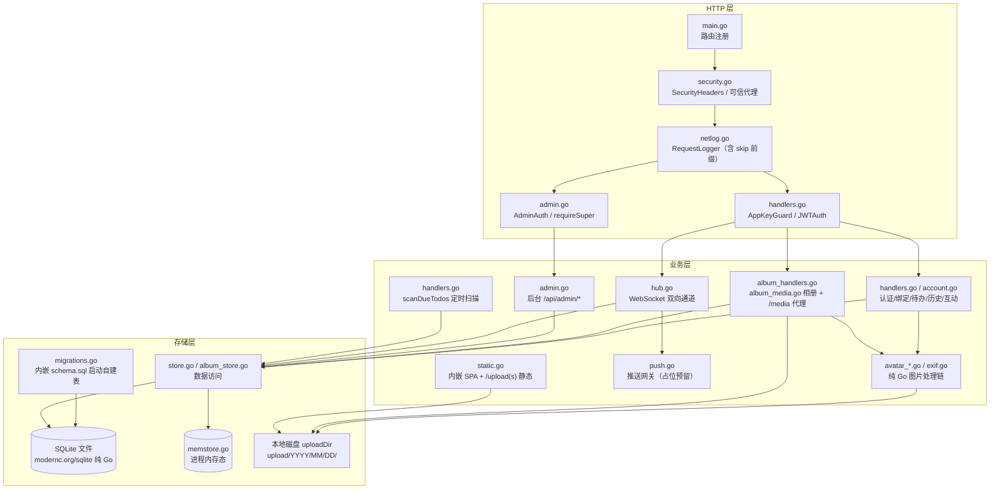
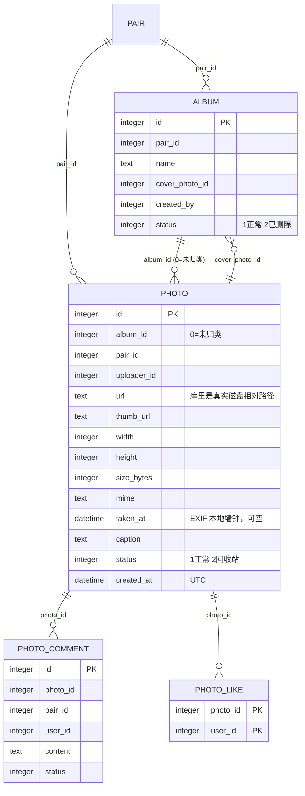
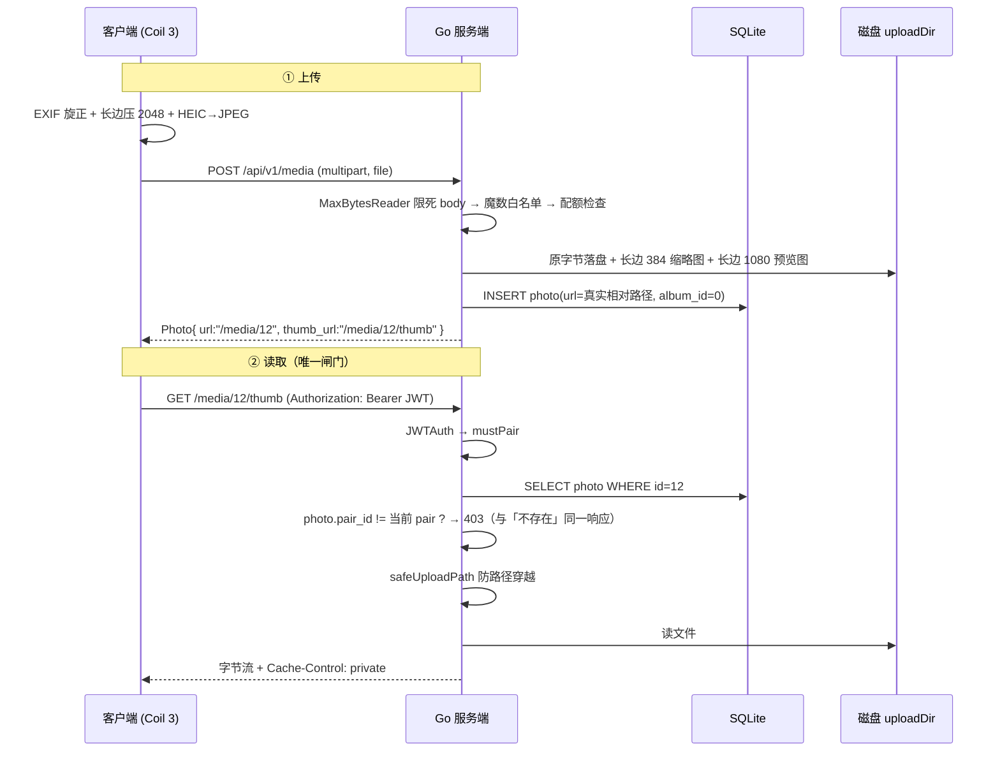
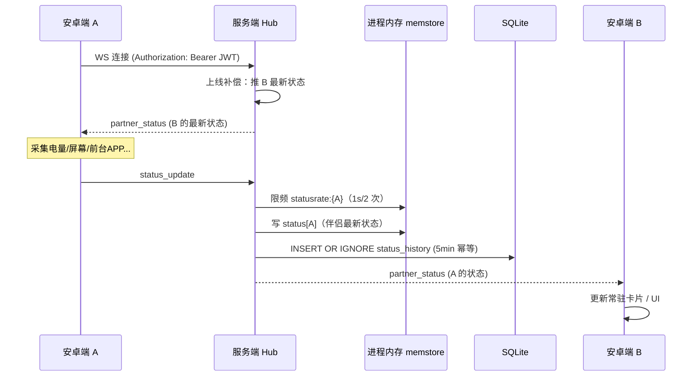
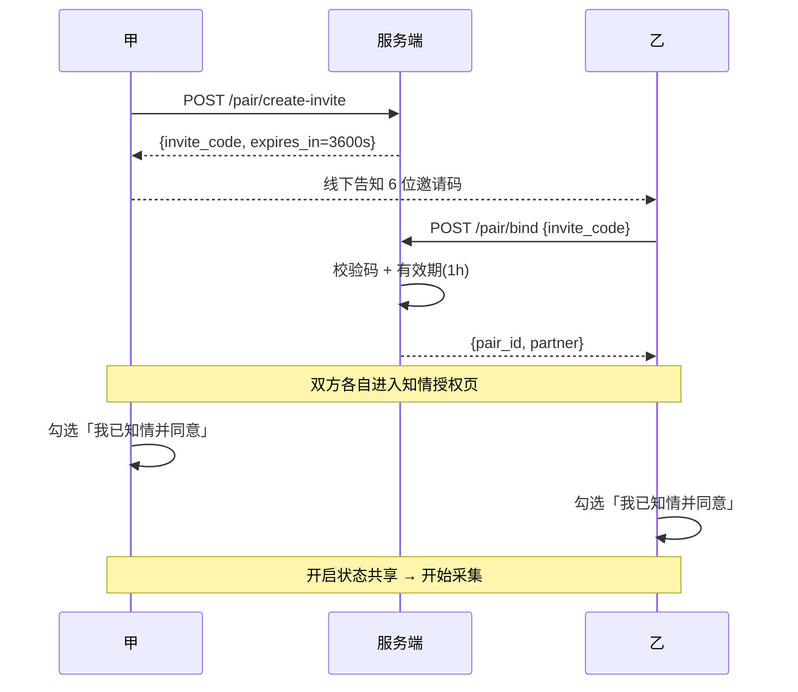
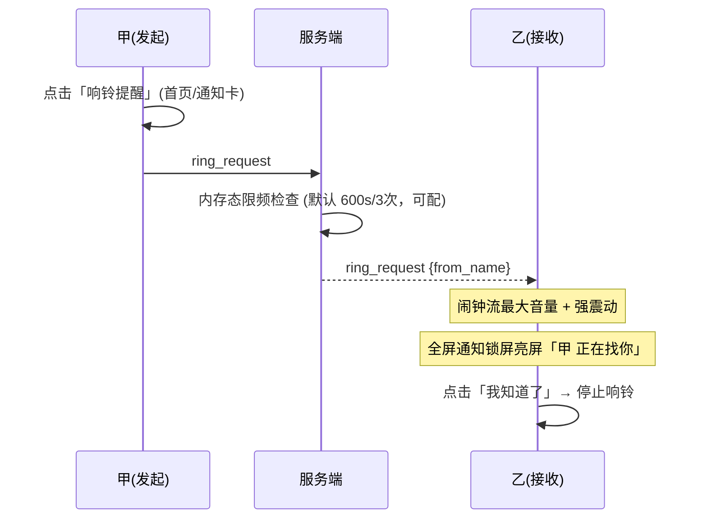
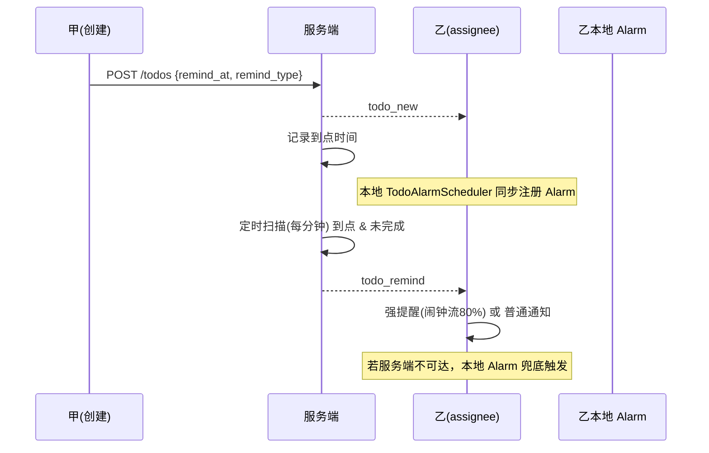
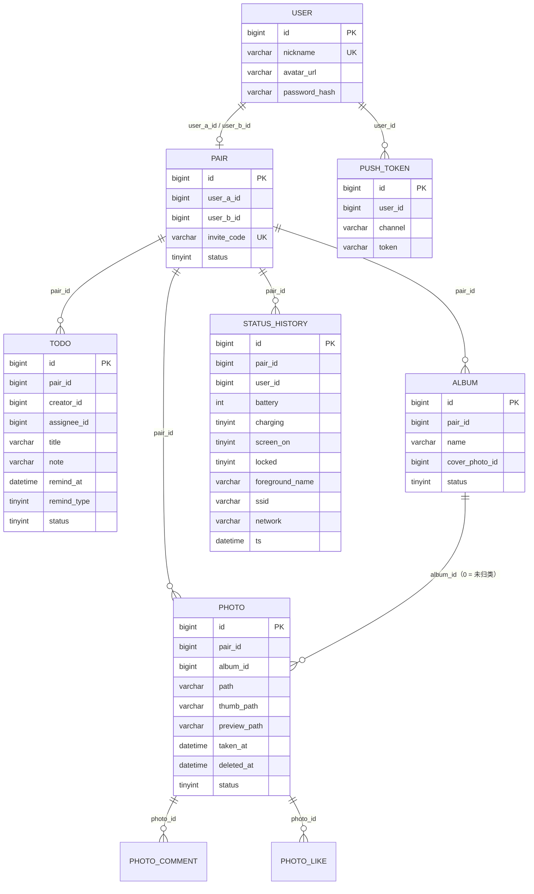
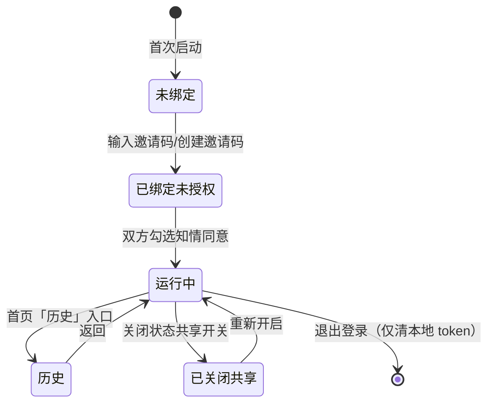

# 林曦日记 · 系统架构产物

> 依据 `DESIGN.md`（五轮设计访谈决策固化）。本文件是架构层的可视化产物，
> 覆盖：整体架构、客户端/服务端模块、核心时序、部署、数据模型、状态机。
>
> 部署与运维口径以 `docs/DEPLOYMENT.md` 为准；本文只画架构形状。

---

## 1. 整体系统架构

**一体化单容器**：一个进程同时提供 App API、WebSocket、运营后台静态页与上传文件服务。
容器内**没有** Nginx / MySQL / Redis——后台前端产物由 `go:embed` 内嵌进二进制，
数据库是内嵌 SQLite 文件，在线态与离线队列是进程内存。TLS 在容器外由宿主机反代终止。

```
  安卓端 A                 安卓端 B                运营后台（浏览器）
  App + 前台服务           App + 前台服务          Vue3 SPA
      |                        |                       |
      |  HTTPS + WSS           |  HTTPS + WSS          |  HTTPS
      +------------------------+-----------------------+
                               |
                               v
  ==========================================================  宿主机
   宝塔 Nginx  ——  唯一 TLS 终止点（443 / Let's Encrypt）
                   反代 -> http://127.0.0.1:7740
                   放行 WebSocket Upgrade
  ==========================================================
                               |  明文 HTTP（同机回环）
                               v
  ==========================================================  容器 LxDay
   单容器，仅监听 :7740                      （无 Nginx/MySQL/Redis）
                               |
                               v
   Gin Engine
     SetTrustedProxies(127.0.0.1, ::1, 10/8, 172.16/12, 192.168/16)
     全局中间件： SecurityHeaders -> RequestLogger -> gin.Recovery
                               |
        +----------+-----------+-----------+-----------+----------+
        v          v           v           v           v          v
     /api/v1/*   /media       /ws      /api/admin   /upload(s)   /  兜底
        |          |           |           |           |          |
     AppKeyGuard  JWTAuth   Authorization  AdminAuth    静态目录    内嵌 SPA
        |         （不过     查询参数    (+require   nosniff +   go:embed
     JWTAuth      AppKey）               Super)     非图强制    webdist
        |          |           |           |        下载         |
        v          v           v           v           v          v
     业务       鉴权图片    WebSocket    后台        静态文件   index.html
     handler    代理        Hub         handler     服务       回退
     handlers   album_      hub.go      admin.go    static.go
     account    media.go    双人房间路由
     album_*
        |          |           |           |           |
        +----------+-----+-----+-----------+-----------+
                         v
   存储（详见 §3.1）
     (1) SQLite 文件    /app/data/lxday.db      <- db_data 卷
         WAL + busy_timeout(5s) + MaxOpenConns(1)
     (2) 上传目录       /app/uploads            <- uploads 卷
         upload/YYYY/MM/DD/ 日期分区
     (3) 进程内存态     memstore.go             重启即失
         在线态 / 伴侣状态 / 离线队列 / 验证码 / 限流 / 相册配额
                         |
                         v
   常驻 goroutine
     scanDueTodos       每分钟扫待办到点
     请求日志 worker     异步落库 + 每 6h 清理超 7 天记录
  ==========================================================
```

**关键设计**
- **双人房间**：`pair_id` 是所有业务数据（待办/相册/状态历史）的隔离键，仅对房间内双方可见。
- **实时链路**：状态 `status_update` → WS → 服务端写**进程内存** + 落 SQLite 历史 → 转发 `partner_status` 给对方。
- **离线补偿**：对方不在线时事件入进程内存队列 `event:queue:user:{uid}`（100 条上限 + 24h TTL），上线后补推。
- **不接商业推送**：私人直装路线，纯 WS + 重连补拉 + 本地 AlarmManager 兜底。
- **TLS 不进容器**：容器只监听明文 `7740`，证书与 HTTPS 强制跳转全在反代层，
  容器换机/换域名不需要重新打镜像。代价是**必须**有反代，直连 `7740` 是明文。

---

## 2. 安卓端模块架构


### 2.1 同步节奏分档

真正决定「主页看起来实不实时」的不是轮询频率，而是伴侣状态**是不是 Compose State**。
此前它是普通 `@Volatile` 字段，WS 消息到了也不触发重组，轮询再密也没用；改成 `StateFlow`
后 WS 到达即刷新（毫秒级）。**下面的轮询只是 WS 不可用时的兜底**，故按场景分档省电。

来源：`android/.../sync/SyncIntervalPolicy.kt`（纯函数、无 Android 依赖，可单测）。

| 场景 | 兜底轮询间隔 | 常量 |
|---|---|---|
| 前台可见（`ProcessLifecycleOwner`） | **10s** | `FOREGROUND_MS` |
| 退到后台但仍亮屏 | **60s** | `BACKGROUND_MS` |
| 息屏 | **5min** | `SCREEN_OFF_MS` |
| 低电量(<15%) / 指定 WiFi / 亮灭屏等 | 即时事件驱动，不受上表约束 | — |

息屏优先级最高：即便 Composition 还活着，息屏也不该按前台频率轮询。

**亮屏判定与前台应用（0821 重写）**

亮/息屏以 `Display.getState()` 为权威来源（`core/ScreenStateProbe.kt`），
分 `On` / `Off` / `Aod` 三档。不能只用 `PowerManager.isInteractive()`：
一加 15 默认开着息屏显示，AOD 状态下它的返回值不足以区分「真亮屏」与「息屏显示」，
而上报时 AOD 必须算作未亮屏，否则伴侣会看到你整夜都在用手机。

前台应用走 `core/ForegroundAppPolicy.kt`（纯策略、可单测）：
查询窗口 60 秒起、取不到则按 5min / 30min / 6h 逐级回退；
认 `ACTIVITY_PAUSED` / `ACTIVITY_STOPPED`（否则回到桌面仍显示上一个应用）；
**息屏不查**（结果无意义且白耗电）；结果缓存 10 分钟 TTL。
该权限（「使用情况访问」）未授予时此项为空，其余状态不受影响。

采集全程在 IO 线程（`StatusForegroundService.refreshNow` → `collectScope`），
通知更新才回主线程。此前采集在主线程、前台档每 10 秒一次，是实打实的 ANR 风险。

**WS 连接参数**

| 项 | 值 | 说明 |
|---|---|---|
| 客户端 ping 心跳 | **15s** | `HEARTBEAT_SECONDS`，走 OkHttp `pingInterval` |
| 服务端判死 | **45s** | ≈3 个心跳周期，避免单次丢包即断连 |
| 重连退避 | 指数退避封顶 16s，叠加 **±20% jitter** | 无 jitter 时双端会同时重连，形成同步的连接风暴 |
| 单帧上限 | **64KB**（`SetReadLimit`） | 不设上限则单个畸形帧即可打爆内存 |

### 2.2 通知渠道清单

全部渠道由 `android/.../service/NotificationChannels.kt` **统一创建**。
为什么必须收敛：`createNotificationChannel` 对**已存在**的渠道只能改名称与描述，
**改不了 importance 与声音**——谁先创建谁决定行为。此前 4 处各自创建且属性不一致，
渠道的实际行为取决于哪段代码先跑，是竞态。

| Channel ID | 名称 | Importance | 用途与行为 |
|---|---|---|---|
| `status_card` | 伴侣状态卡 | `LOW` | 常驻前台服务通知卡；静默更新、不计角标、无声无振动 |
| `status_event` | 互动提醒 | `HIGH` | 求陪伴 / 求冷静 / 待办，需要弹横幅引起注意 |
| `status_ring` | 紧急响铃 | `HIGH` | 强制响铃全屏通知；**渠道本身不出声**（铃声由 `RingHelper` 的播放器控制，否则叠音） |
| `status_quiet` | 伴侣动态（静默） | `LOW` | 对方息屏/亮屏、上线/下线；只落通知栏，不弹横幅、不响铃、不振动、不亮灯 |

`status_quiet` 显式 `setSound(null)` + 关振动，尽管低于 `IMPORTANCE_DEFAULT` 的渠道系统本就不出声：
一是防厂商 ROM 的默认行为差异，二是避免以后有人误改 importance 时突然开始响。

通知 id：状态卡固定 `10001`；静默动态固定 `10003`（同类事件覆盖更新而非堆叠一屏）；
待办提醒按待办 id 派生（`20000 + todoId % 10000`），便于覆盖与精确撤销。

---

## 3. 服务端模块架构



**WS 消息协议**（JSON）

| type | 方向 | 说明 |
|---|---|---|
| `status_update` | 客户端→服务端 | 上报全量状态（服务端写内存态 + 落历史 + 转发，限频 1s/2 次） |
| `partner_status` | 服务端→对方 | 对方实时状态（含上线补偿） |
| `comfort_request` / `calm_request` | 双向 | 求陪伴 / 求冷静 |
| `ring_request` | 双向 | 强制响铃（服务端限频 10min/3次） |
| `low_battery` | 服务端→对方 | 电量 <15% |
| `wifi_joined` | 双向 | 连接指定 WiFi |
| `todo_new` / `todo_completed` | 服务端→对方 | 待办事件 |
| `todo_remind` | 服务端→双方 | 待办到点提醒 |
| `album_new` | 服务端→对方 | 伴侣上传了新照片（普通优先级，不进高优离线补偿队列） |
| `ring_cancel` / `ring_stopped` | 双向 | 发起方撤回响铃 / 接收方已停止的回执 |
| `action_rejected` | 服务端→发送方 | 上行动作被拒（如超频） |
| `profile_updated` | 服务端→对方 | 资料变化，对方据此重新拉取 |
| `paired` / `unbound` | 服务端→对方 | 绑定成功 / 已解绑 |
| `admin_notice` | 服务端→客户端 | 后台通知 |

---

## 3.1 存储层

三层，各自的边界与代价：

| 层 | 载体 | 存什么 | 丢了会怎样 |
|---|---|---|---|
| 关系数据 | **内嵌 SQLite 文件**（`db_data` 卷） | 用户/绑定/待办/相册/状态历史/后台配置与日志 | 业务数据全失，必须备份 |
| 易失状态 | **进程内存**（`memstore.go`） | 在线态、伴侣最新状态、离线事件队列、验证码、各类限流计数、相册配额 | 重启即全丢；见下「重启后的实际表现」 |
| 二进制 | **本地磁盘**（`uploads` 卷） | 头像、相册原图/预览图/缩略图、后台 APK/LOGO | 图片全失，DB 里留下指向空文件的行 |

### SQLite

`modernc.org/sqlite` 纯 Go 实现，**无 CGO**，故 `CGO_ENABLED=0` 即可静态编译进 alpine 镜像
（这是选它而非 `mattn/go-sqlite3` 的唯一理由：后者要 gcc，多阶段构建与镜像体积都会失控）。

```
DSN: file:<db.path>?_pragma=busy_timeout(5000)
                   &_pragma=journal_mode(WAL)
                   &_pragma=foreign_keys(on)
SetMaxOpenConns(1)
```

- **WAL**：读不阻塞写，单进程下的读多写少最划算。
- **busy_timeout 5s**：锁竞争时等待而非立刻 `database is locked` 报错。
- **`MaxOpenConns(1)`**：SQLite 单写者，多连接并发写只会换来一堆 locked 错误。
  情侣双人应用的并发量用一条连接足够；代价是**慢查询会串行阻塞后面的请求**。
- **零手动导入**：`migrations.go` 用 `go:embed` 内嵌 `server/sql/schema.sql`，
  启动逐条执行（全部 `CREATE TABLE / INDEX IF NOT EXISTS`，幂等）。
  随后 `addColumns` 按 `PRAGMA table_info` 探测后补列——SQLite 的
  `ALTER TABLE ADD COLUMN` 不支持 `IF NOT EXISTS`，不先探测则老库每次启动都报
  `duplicate column name`。

**表清单**：共 **16 张**，以 `server/sql/schema.sql` 为唯一真源，此处不复制列定义。
（注意 `user` 在 schema 里是 `"user"` 带引号形态——它是 SQL 保留字。）
分组：

| 分组 | 表 |
|---|---|
| 账号与关系 | `user`、`pair` |
| 业务 | `todo`、`status_history` |
| 相册（详见 [§3.2](#32-相册模块)） | `album`、`photo`、`photo_comment`、`photo_like` |
| 后台与运维 | `admin_user`、`app_setting`、`app_version`、`admin_audit_log`、`notify_template`、`notify_record`、`request_log` |
| 预留 | `push_token`（不接商业推送，接口为占位） |

### 进程内存态

`memstore.go` 单实例，一把 `sync.Mutex` + 五个 map，全部**惰性过期**（读时判 `exp`，无清扫协程）。
两类形态：**uid 直接作 map 键**的在线态/状态/队列，与**字符串键**的 kv/计数器。

| 内容 | 形态 | TTL / 上限 | 说明 |
|---|---|---|---|
| 在线标记 | `online[uid]` | **60s**，WS 心跳续期 | 过期即视为离线 |
| 伴侣最新状态 | `status[uid]` | **无 TTL**（进程存活期内常驻） | 上线补偿推给对方的那份 |
| 离线事件队列 | `eventQ[uid]` | **100 条上限 + 24h TTL** | 超限丢最旧；补拉时过滤过期项 |
| 邮箱验证码 | `emailcode:<email>` | **10min** | — |
| 验证码发送冷却 | `emailcode:cd:<email>` | **60s** | `kvSetNX` 置位，非空即拒发 |
| 验证码试错计数 | `emailcode:try:<email>` | **15min / 5 次** | 达上限即作废该码（6 位数字仅百万组合） |
| App 登录失败 | `login:fail:<account>` | **10min / 5 次** | — |
| 后台登录失败 | `adminlogin:fail:<username>` | **10min / 5 次** | — |
| 绑定失败 | `bind:fail:<uid>` | **10min / 5 次** | — |
| 响铃冷却 | `pair:ring:cooldown:<pairId>` | **600s / 3 次**（可配） | `ring_cooldown_seconds/limit` |
| 互动冷却 | `pair:interact:cooldown:<kind>:<pairId>` | **7s / 1 次** | comfort、calm 各自分桶 |
| 状态上报限频 | `statusrate:<uid>` | **1s / 2 次** | 每条 `status_update` 都会落库，不限频可写爆磁盘 |
| 相册当日张数 | `media:cnt:<YYYY-MM-DD>:<uid>` | **25h / 200 张** | 键按日期分桶，TTL 只负责回收 |
| 相册当日字节 | `media:bytes:<YYYY-MM-DD>:<uid>` | **25h / 500MB** | 判额在落盘前，记账在落盘成功后 |

**重启后的实际表现**（这是选内存态换掉 Redis 的真实代价）：
双方显示为离线直到下次心跳；伴侣状态卡短暂空白直到下次上报；
**未补推的离线事件永久丢失**；验证码全部失效需重发；所有限流计数归零
（登录/绑定爆破窗口被重置，反复重启可绕过——但重启需要服务器权限，接受）；
相册配额归零（防刷盘护栏而非计费，宁可偶尔放宽）。

**横向扩容的硬约束**：以上全部是单进程内存，且 `hub.go` 的 WS 路由表也在内存里。
起第二个副本会导致：两副本各自维护一半在线用户，跨副本的伴侣互相看不到对方在线、
消息转发直接丢。要扩容必须先把内存态与 WS 路由换成外部共享存储（Redis + Pub/Sub 或网关路由）。

### 磁盘

```
uploadDir/                       容器内 /app/uploads（uploads 卷）
  upload/YYYY/MM/DD/
      <随机名>.<ext>             新：日期分区（头像 / 相册原图）
      <随机名>_thumb.jpg|png     相册缩略图（长边 384，等比缩放非方裁）
      <随机名>_preview.jpg|png   相册中间尺寸（长边 1080，大图页先加载这档）
  <历史文件>                     旧：兼容历史头像与后台上传的 APK / LOGO
```

- **日期分区**：单目录堆到几十万文件后 `readdir` 与备份都会明显变慢，按天分目录天然分摊。
- **两条静态路由**：`/upload/*` 对应 `uploadDir/upload/`（新），`/uploads/*` 对应 `uploadDir/`（旧兼容）。
  两者都**关闭目录列举**，并下发 `nosniff` + 对非图片强制 `Content-Disposition: attachment`
  （缓解上传 html/svg 造成的存储型 XSS）。
- **两条静态路由都无鉴权**：只靠随机文件名保密。故**相册照片的真实路径绝不出服务端**——
  对外一律 `/media/<photoId>`，走 §3.2 的鉴权代理。头像仍走 `/upload/`
  （可分享性优先于保密性，且客户端要能直接喂给图片库）。

---

## 3.2 相册模块

源码：`album_handlers.go`（HTTP）、`album_media.go`（上传 + 鉴权代理）、`album_store.go`（数据访问）。
完整接口文档见 [docs/ALBUM.md](docs/ALBUM.md)。

### 表关系



**四张表都带 `pair_id`**：归属校验只查本表一次，不必为每次读写多跳一次 join。
`photo.pair_id` 相对 `album` 是冗余，但正是它让「未归类照片（`album_id=0`）」仍能判定归属。
`photo_like` 用 `(photo_id,user_id)` 复合主键，重复点赞天然不会产生第二行。

### `/media` 鉴权代理数据流



**关键点**

- **对外 URL 永远是 `/media/<id>`，真实磁盘路径不出服务端**。`Photo.diskPath` / `diskThumb`
  是**非导出字段**（首字母小写），`encoding/json` 根本看不见它们，比写 `json:"-"` 更硬——
  以后有人给结构体加字段也不会手滑漏标；
  `/upload` 与 `/uploads` 静态目录完全无鉴权，真实路径一旦经截图/日志/Referer 外泄，
  任何人无需登录即可看到私密照片。
- **归属不符与 id 不存在返回同一个响应**：区别对待等于给出「该 id 存在」的探测信号。
- **挂在根路径、不经 `AppKeyGuard`**：只挂 `JWTAuth()`。客户端用自建 Coil `ImageLoader`
  （`AppImageLoader.kt`）在拦截器里给每个图片请求补 `Authorization` 头。
- **照片 URL 不进 `request_log`**：netlog 的 skip 前缀含 `/media` 与 `/upload`，
  否则任何能看后台「网络日志」页的管理员都能从日志直接点开私密相册。
- **响应头** `Cache-Control: private, max-age=86400`：只允许终端自己缓存，禁止中间代理与 CDN 留副本。
- **运营后台的照片审核只给元数据**：管理员没有用户 token，本就读不了 `/media/<id>`，
  返回图片 URL 只会凭空多一条泄露面。

### 路由形状的坑

gin 的路由树**不允许同一层级同时存在静态段与通配段**——同时注册 `/albums/summary` 与
`/albums/:id` 会在**启动时 panic**（不是 404，是服务起不来）。故只注册通配路由，
在 handler 内识别保留字：`handleAlbumByID` 认 `summary`，`handlePhotoByID` 认
`on-this-day` 与 `recycled`。对外路径不变，客户端无感。

### 上传配额

每人每天 **200 张 / 500MB**，超限 HTTP 429 + 业务码 `1020`。计数落**进程内存**
（键按日期分桶、TTL 25h），重启归零属可接受损失：这是防刷盘护栏而非计费。
判额在落盘前，**记账在落盘成功后**——失败的上传不该消耗额度。

---

## 4. 核心时序

### 4.1 状态实时同步



### 4.2 绑定 + 知情授权



### 4.3 强制响铃（紧急找人）



### 4.4 待办到点提醒（双保险）



---

## 5. 部署架构（单容器）

完整步骤、反代配置、升级与备份口径见 **[docs/DEPLOYMENT.md](docs/DEPLOYMENT.md)**；本节只画形状。

```
   公网   https://love.lxii.cc
          |  443（Let's Encrypt，宝塔申请与续期）
  ==========================================================  宿主机
   宝塔 Nginx / Caddy  ——  唯一 TLS 终止点
     一个反代覆盖全部路径：/ 后台 · /api · /ws · /upload(s) 都在同端口
     需放行 WebSocket Upgrade（宝塔默认已带）
          |  proxy_pass http://127.0.0.1:7740
  ==========================================================
   Docker  compose 只有一个 service: app
     container_name  LxDay
     image           ghcr.io/lxii-build/lxday:latest
     ports           7740 -> 7740      内外一致，宝塔容器列表好认
     restart         unless-stopped
     healthcheck     wget /healthz     30s / 5s / retries 3
     env（同目录 .env 注入）   JWT_SECRET 必填 · APP_KEY
     容器内           /app/linxi-server  单二进制，内嵌后台 SPA + schema
                     /app/config.yaml   可选，缺省全走 env + 默认值
          |                                    |
          | volume db_data                     | volumes uploads + uploads_private
          v                                    v
     /app/data/lxday.db                   /app/uploads/ + /app/uploads-private/
     SQLite 主文件 + WAL/SHM 附属文件        公开资源 + /media 鉴权相册媒体
  ==========================================================
```

**镜像构建**（仓库根 `Dockerfile`，三阶段）

```
阶段① node:22-alpine
      admin/ -> rm -rf node_modules dist -> npm install -> npm run build
      先清本地产物：避免跨平台二进制污染（本地 node_modules 被 COPY 进去）
阶段② golang:1.25-alpine
      server/ -> 用阶段①的 dist 覆盖 webdist/ -> go mod tidy
              -> CGO_ENABLED=0 go build -trimpath -ldflags "-s -w"
      能这样静态编译的前提是 modernc.org/sqlite 是纯 Go 实现（无需 gcc）
阶段③ alpine:3.20
      只拷二进制 + ca-certificates / tzdata / wget
      mkdir /app/data /app/uploads /app/uploads-private；以非 root app 运行并预先 chown
```

**运维要点**
- **无状态镜像 + 三个卷**：升级就是 `docker compose pull && up -d`，SQLite、公开资源和私密相册媒体都在卷里不动。
  清库需显式 `down -v`（会同时删掉照片，谨慎）。
- **超管初始随机口令只在启动日志打印一次**（`docker compose logs app`），首登强制改密。
- **备份对象只有两个**：`db_data` 卷（SQLite 文件，热备建议连 WAL 一起或先 checkpoint）与
  `uploads` 卷。没有 MySQL dump 这回事了。
- **直连 `7740` 是明文**：容器内不做 TLS，反代未就位前不要把 `7740` 暴露到公网。

---

## 6. 数据模型（ER）

> 下图沿用初版（MySQL 时期）的类型标注；**现行存储是内嵌 SQLite**，实际 DDL 以
> `server/sql/schema.sql` 为准。相册的 4 张表见 [§3.2 表关系](#表关系)。



**内存态**：不落库的易失状态（在线态/伴侣状态/离线队列/验证码/限流/相册配额）
全部在进程内存里，键名、TTL 与上限见 **[§3.1 进程内存态](#进程内存态)**。

---

## 7. 应用状态机



---

## 8. 与需求对照

| 需求 | 架构落点 |
|---|---|
| 双人绑定 + 数据隔离 | `pair` 表 + 8 位邀请码 1h 有效 + `pair_id` 隔离键 |
| 实时手机状态同步 | WS `status_update` → 进程内存 → `partner_status` 转发；客户端侧 `StateFlow` 驱动重组 |
| 状态历史 | `status_history` 5min 聚合永久保留 + 时间线/电量曲线接口 |
| 常驻通知卡 | `StatusForegroundService` + RemoteViews 收起/展开（渠道 `status_card`） |
| 强制响铃 | `RingHelper`（闹钟流+全屏+限频+7s 自动停止+双向撤回，渠道 `status_ring`） |
| 双向待办 + 到点提醒 | `todo` 表 + `todo_remind` WS + 本地 Alarm 双保险 |
| 求陪伴/求冷静 | `comfort_request` / `calm_request` WS 事件（渠道 `status_event`） |
| 伴侣动态静默提醒 | 渠道 `status_quiet`（`IMPORTANCE_LOW` + 无声无振动） |
| **共同相册** | `album`/`photo`/`photo_comment`/`photo_like` 四表 + `POST /media` 上传 + `/media/<id>` 鉴权代理（见 §3.2） |
| 推送与保活 | 纯 WS + 前台服务 + 电池白名单 + vivo/OPPO 引导 |
| 隐私合规 | 知情授权页 + 共享总开关 + TLS 全链路 + 相册鉴权代理（真实路径不出服务端） |
