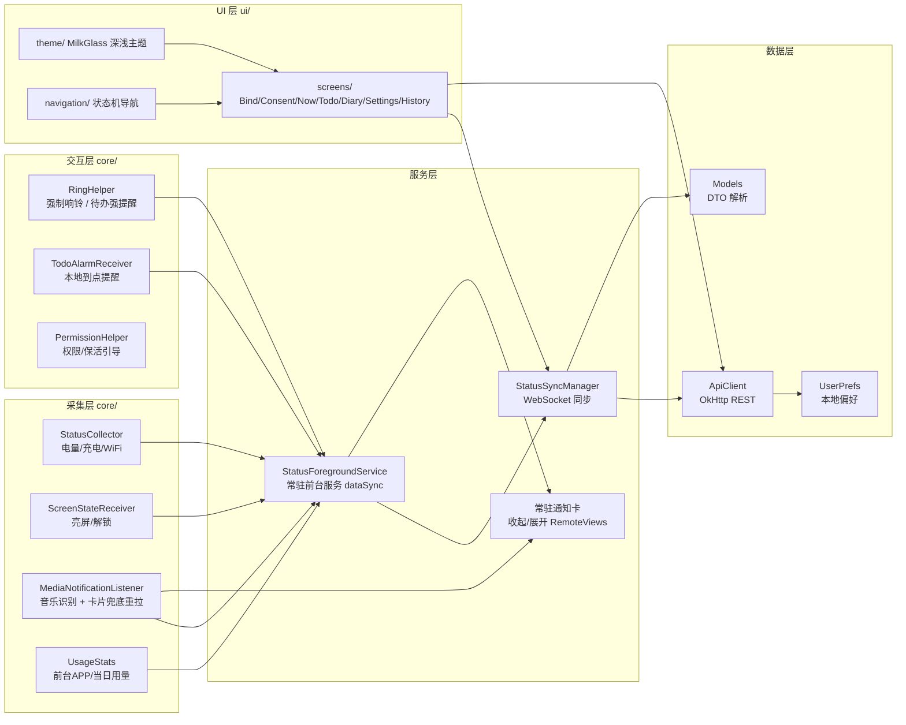
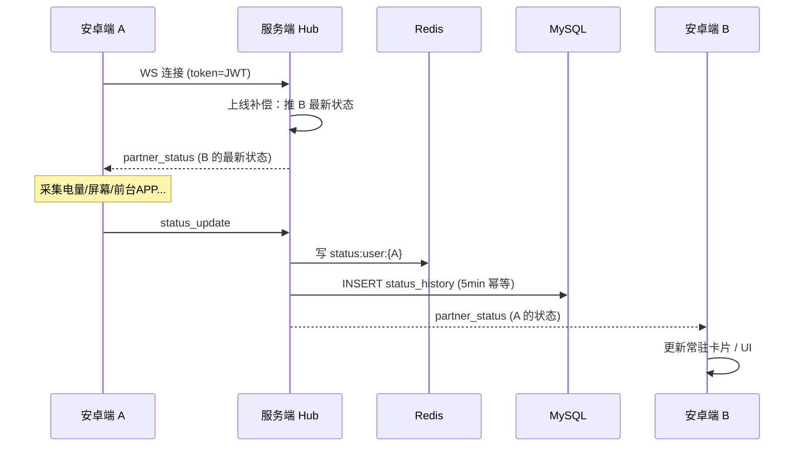
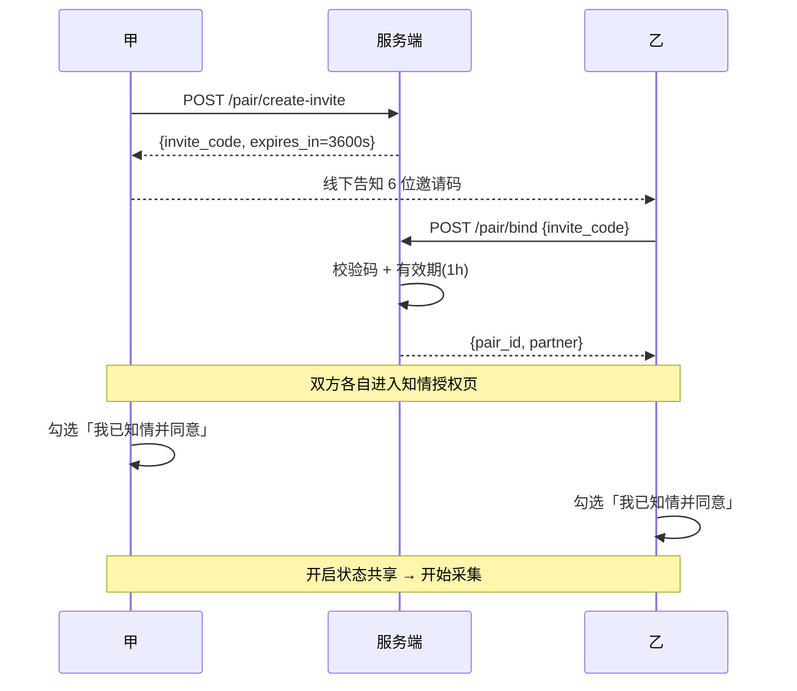
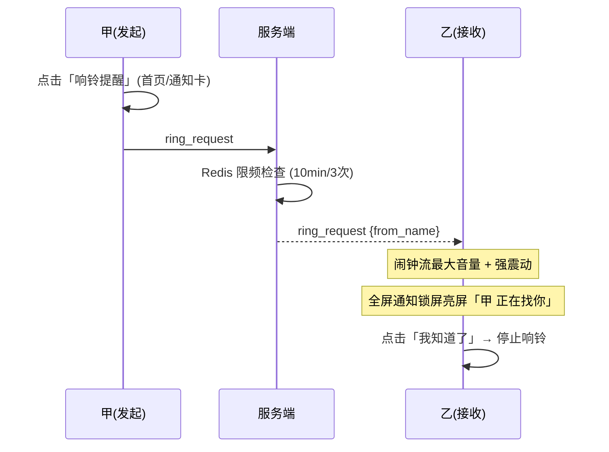
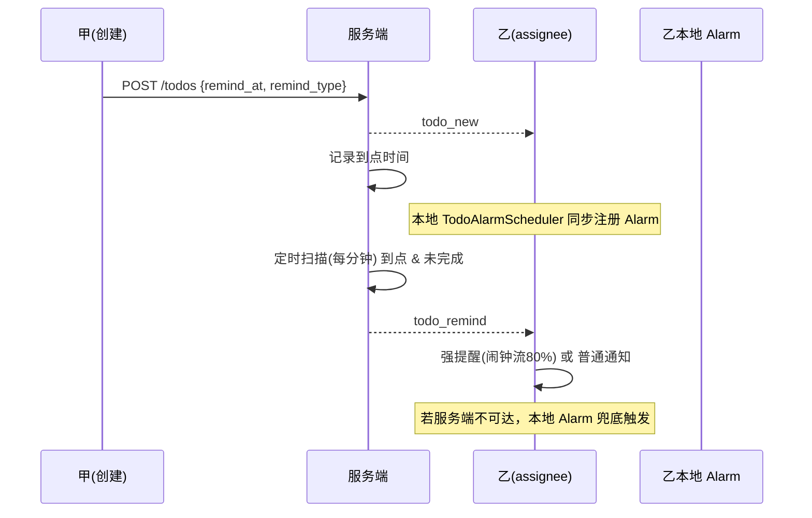
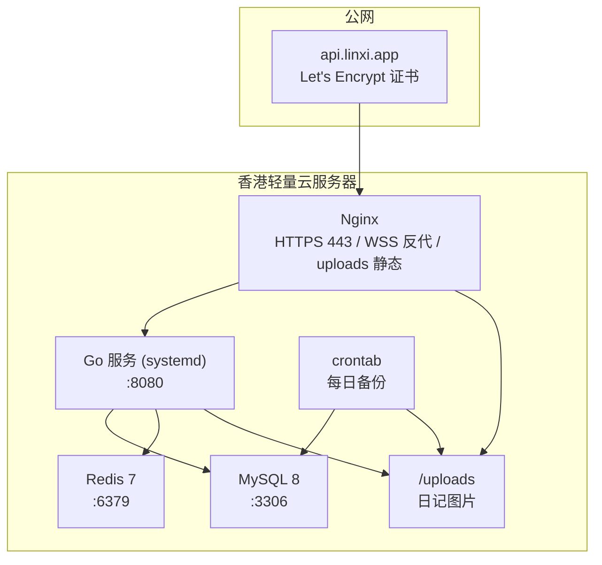
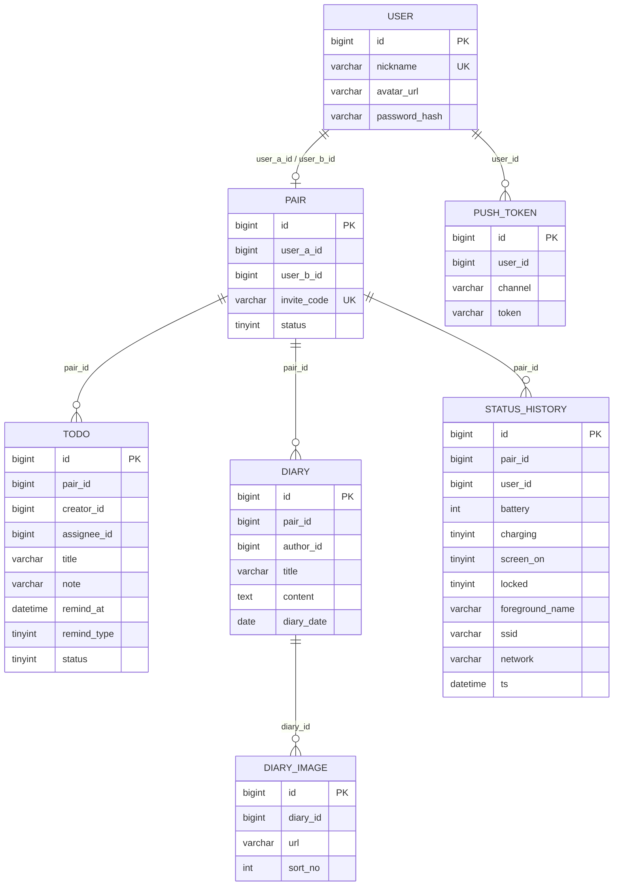
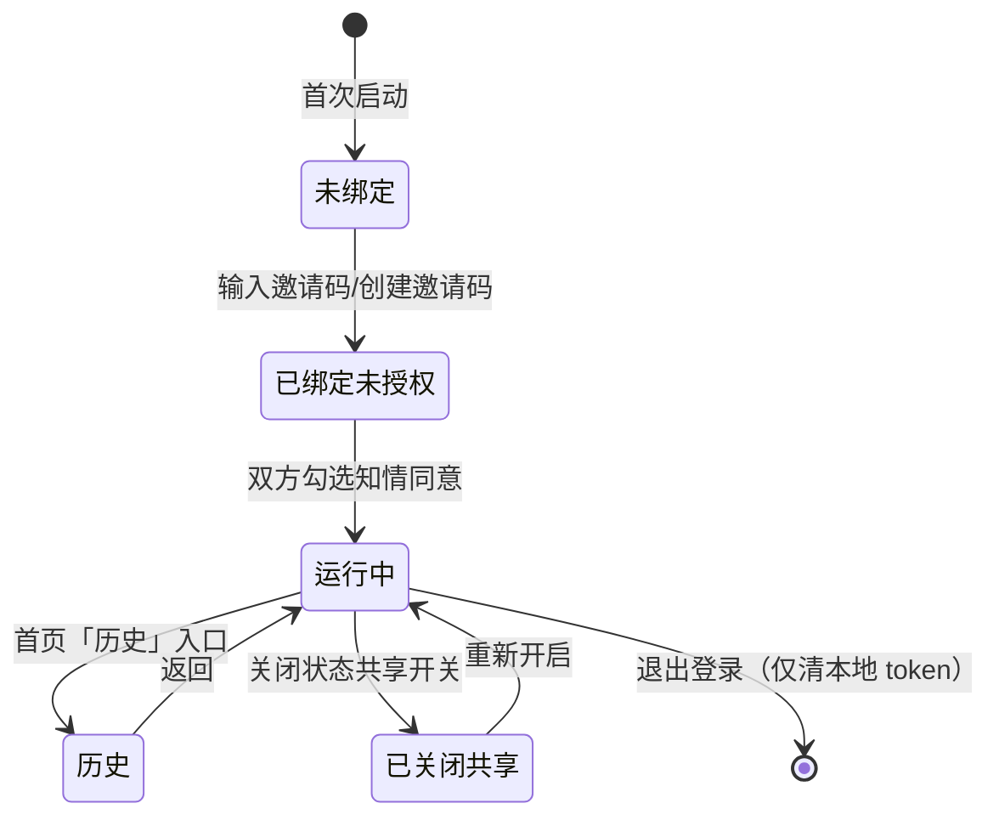

# 林曦日记 · 系统架构产物

> 依据 `DESIGN.md`（五轮设计访谈决策固化）。本文件是架构层的可视化产物，
> 覆盖：整体架构、客户端/服务端模块、核心时序、部署、数据模型、状态机。

---

## 1. 整体系统架构

```mermaid
graph TB
    subgraph "安卓端 A（伴侣甲）"
        A_UI["UI 层<br/>Compose 4Tab 页面"]
        A_CORE["核心层<br/>采集/响铃/监听/保活"]
        A_SERVICE["常驻前台服务<br/>StatusForegroundService"]
        A_SYNC["同步层<br/>StatusSyncManager"]
        A_NOTIF["常驻通知卡<br/>RemoteViews"]
        A_LOCAL["本地存储<br/>SharedPreferences"]
    end

    subgraph "安卓端 B（伴侣乙）"
        B_UI["UI 层<br/>Compose 4Tab 页面"]
        B_CORE["核心层<br/>采集/响铃/监听/保活"]
        B_SERVICE["常驻前台服务<br/>StatusForegroundService"]
        B_SYNC["同步层<br/>StatusSyncManager"]
        B_NOTIF["常驻通知卡<br/>RemoteViews"]
        B_LOCAL["本地存储<br/>SharedPreferences"]
    end

    subgraph "服务端（香港轻量云）"
        GATE["Nginx<br/>HTTPS/WSS + /uploads 静态"]
        GO["Go 服务（Gin）"]
        HUB["WebSocket Hub<br/>双人房间路由"]
        API["REST API<br/>认证/绑定/待办/日记/历史"]
        TASK["定时任务<br/>待办到点扫描"]
        MYSQL[("MySQL 8<br/>用户/绑定/待办/日记/状态历史")]
        REDIS[(("Redis 7<br/>在线/最新状态/离线补偿队列"))]
        DISK["本地磁盘<br/>uploads/diary/ 图片"]
    end

    A_SYNC <-->|"WSS TLS"| GATE
    B_SYNC <-->|"WSS TLS"| GATE
    A_UI --> A_SERVICE
    A_CORE --> A_SERVICE
    A_SERVICE --> A_SYNC
    A_SERVICE --> A_NOTIF
    A_CORE --> A_LOCAL

    GATE --> GO
    GO --> HUB
    GO --> API
    GO --> TASK
    HUB --> MYSQL
    HUB --> REDIS
    API --> MYSQL
    API --> REDIS
    API --> DISK
    TASK --> MYSQL
    TASK --> HUB
```

**关键设计**
- **双人房间**：`pair_id` 是所有业务数据（待办/日记/状态历史）的隔离键，仅对房间内双方可见。
- **实时链路**：状态 `status_update` → WS → 服务端写 Redis + 落历史 → 转发 `partner_status` 给对方。
- **离线补偿**：对方不在线时事件入 Redis List `event:queue:user:{uid}`，上线后补推。
- **不接商业推送**：私人直装路线，纯 WS + 重连补拉 + 本地 AlarmManager 兜底。

---

## 2. 安卓端模块架构



**刷新频率**
| 场景 | 频率 |
|---|---|
| 前台 | 事件驱动即时（亮屏/解锁/音乐/充电变化）+ 15s 轮询 |
| 后台 | AlarmManager 每 5 分钟 |
| 低电量(<15%) / 指定 WiFi | 即时高优事件 |

---

## 3. 服务端模块架构

```mermaid
graph TD
    subgraph "HTTP 层"
        AUTH["handlers.go<br/>JWT 鉴权中间件"]
        ROUTE["main.go<br/>路由注册"]
    end

    subgraph "业务层"
        H["handlers.go<br/>认证/绑定/待办/日记/历史/上传/互动"]
        HUB["hub.go<br/>WebSocket 双向通道"]
        PUSH["push.go<br/>推送网关（占位预留）"]
        SCAN["handlers.go<br/>scanDueTodos 定时扫描"]
    end

    subgraph "存储层"
        STORE["store.go<br/>数据访问"]
        MYSQL[("MySQL")]
        REDIS[(("Redis"))]
        DISK["本地磁盘"]
    end

    ROUTE --> AUTH
    AUTH --> H
    AUTH --> HUB
    H --> STORE
    HUB --> STORE
    SCAN --> STORE
    H --> DISK
    STORE --> MYSQL
    STORE --> REDIS
    HUB --> PUSH
```

**WS 消息协议**（JSON）

| type | 方向 | 说明 |
|---|---|---|
| `status_update` | 客户端→服务端 | 上报全量状态（服务端写 Redis + 落历史 + 转发） |
| `partner_status` | 服务端→对方 | 对方实时状态（含上线补偿） |
| `comfort_request` / `calm_request` | 双向 | 求陪伴 / 求冷静 |
| `ring_request` | 双向 | 强制响铃（服务端限频 10min/3次） |
| `low_battery` | 服务端→对方 | 电量 <15% |
| `wifi_joined` | 双向 | 连接指定 WiFi |
| `todo_new` / `todo_completed` | 服务端→对方 | 待办事件 |
| `todo_remind` | 服务端→双方 | 待办到点提醒 |
| `diary_new` | 服务端→对方 | 新日记 |

---

## 4. 核心时序

### 4.1 状态实时同步



### 4.2 绑定 + 知情授权



### 4.3 强制响铃（紧急找人）



### 4.4 待办到点提醒（双保险）



---

## 5. 部署架构（香港轻量云 2C2G）



**Nginx 关键配置**
```nginx
# HTTPS/WSS 反代
location / {
    proxy_pass http://127.0.0.1:8080;
}
location /ws {
    proxy_pass http://127.0.0.1:8080;
    proxy_http_version 1.1;
    proxy_set_header Upgrade $http_upgrade;
    proxy_set_header Connection "upgrade";
    proxy_read_timeout 3600s;
}
# 日记图片静态服务
location /uploads/ {
    alias /var/www/lx/uploads/;
}
```

---

## 6. 数据模型（MySQL ER）



**Redis Key 约定**

| Key | 类型 | TTL | 说明 |
|---|---|---|---|
| `online:user:{uid}` | String | 60s | 心跳在线标记 |
| `status:user:{uid}` | String(JSON) | 24h | 最新实时状态 |
| `event:queue:user:{uid}` | List | - | 离线事件补偿队列 |
| `pair:ring:cooldown:{pairId}` | String | 600s | 响铃限频计数 |

---

## 7. 应用状态机



---

## 8. 与需求对照

| 需求 | 架构落点 |
|---|---|
| 双人绑定 + 数据隔离 | `pair` 表 + 邀请码 1h 有效 + `pair_id` 隔离键 |
| 实时手机状态同步 | WS `status_update` → Redis → `partner_status` 转发 |
| 状态历史 | `status_history` 5min 聚合永久保留 + 时间线/电量曲线接口 |
| 常驻通知卡 | `StatusForegroundService` + RemoteViews 收起/展开 |
| 强制响铃 | `RingHelper`（闹钟流+全屏+限频） |
| 双向待办 + 到点提醒 | `todo` 表 + `todo_remind` WS + 本地 Alarm 双保险 |
| 求陪伴/求冷静 | `comfort_request` / `calm_request` WS 事件 |
| 共同日记 + 图片 | `diary` + 本地磁盘上传 + Nginx 静态 |
| 推送与保活 | 纯 WS + 前台服务 + 电池白名单 + vivo/OPPO 引导 |
| 隐私合规 | 知情授权页 + 共享总开关 + TLS 全链路 |
