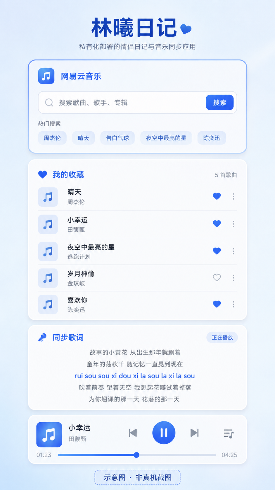
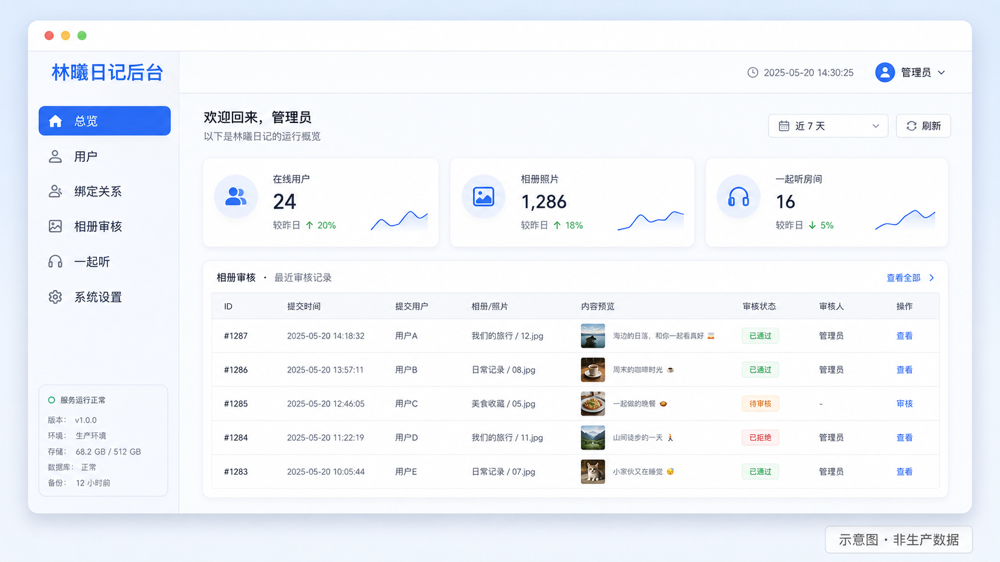

# 界面截图与示意图

仓库当前无法在文档构建阶段启动 Android 真机，因此这里同时保留两类证据：

1. 真实页面由 `admin/scripts/mobile-audit.mjs` 和真机发布清单验证；
2. 下图是 AI 生成的产品示意图，用来说明信息架构和视觉方向，**不是生产数据、不是
   真机截图，也不应作为像素级验收依据**。

## Android 音乐、收藏与歌词

示意图覆盖“网易云音乐”搜索、“我的收藏”、同步歌词和播放控制。实际页面通过
`MusicHomeScreen`、`LyricsScreen` 和“我的 → 音乐设置”进入；歌词高亮基于播放器毫秒进度，
点击歌词可以跳转，歌词候选搜索仍在本机完成。

## 运营后台

示意图展示后台的导航、指标卡、审计表和“一起听”运营入口。真实后台由 Go 服务端内嵌
构建产物提供，生产数据必须经过服务端鉴权和角色校验。

## 真机截图流程

有可用设备时，按 [SELFTEST.md](SELFTEST.md) 执行登录 → 绑定 → “我的” → 音乐设置 →
音乐库 → 歌词 → 一起听，并把脱敏截图放在发布说明中。截图不得包含网易云 Cookie、
邀请码、JWT、私密照片原图、SMTP/存储凭据或真实审计数据。
